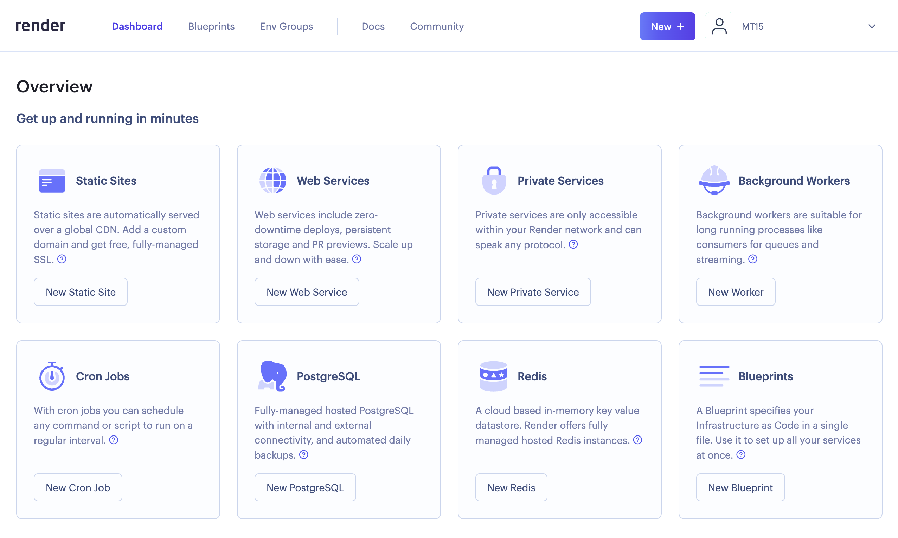
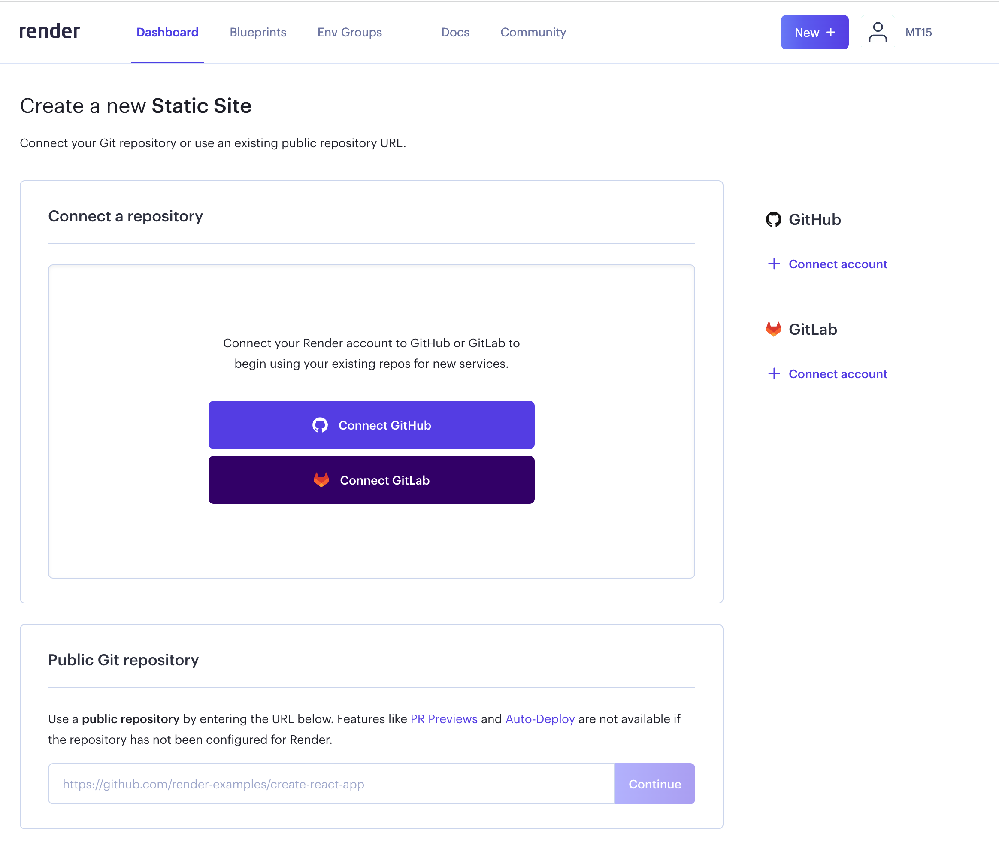
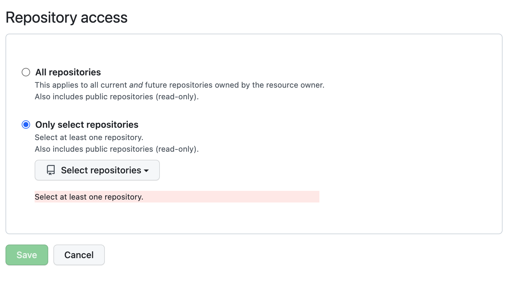
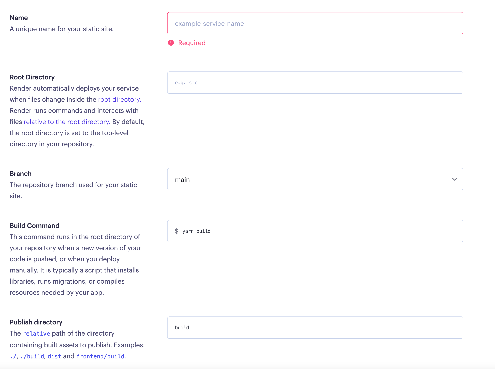
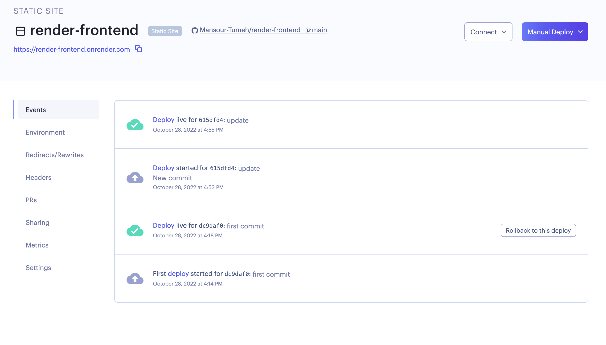
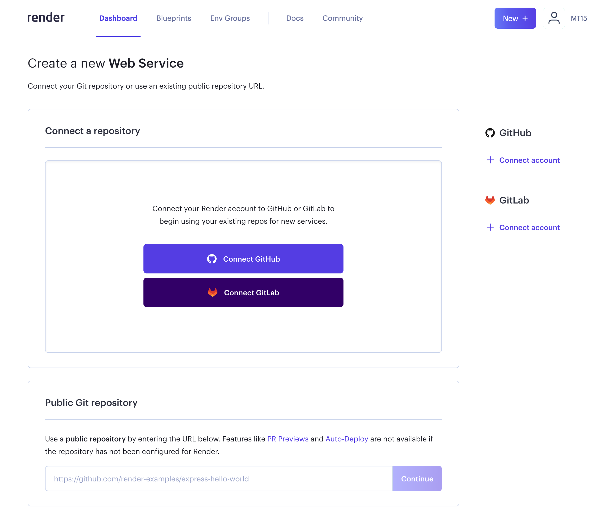
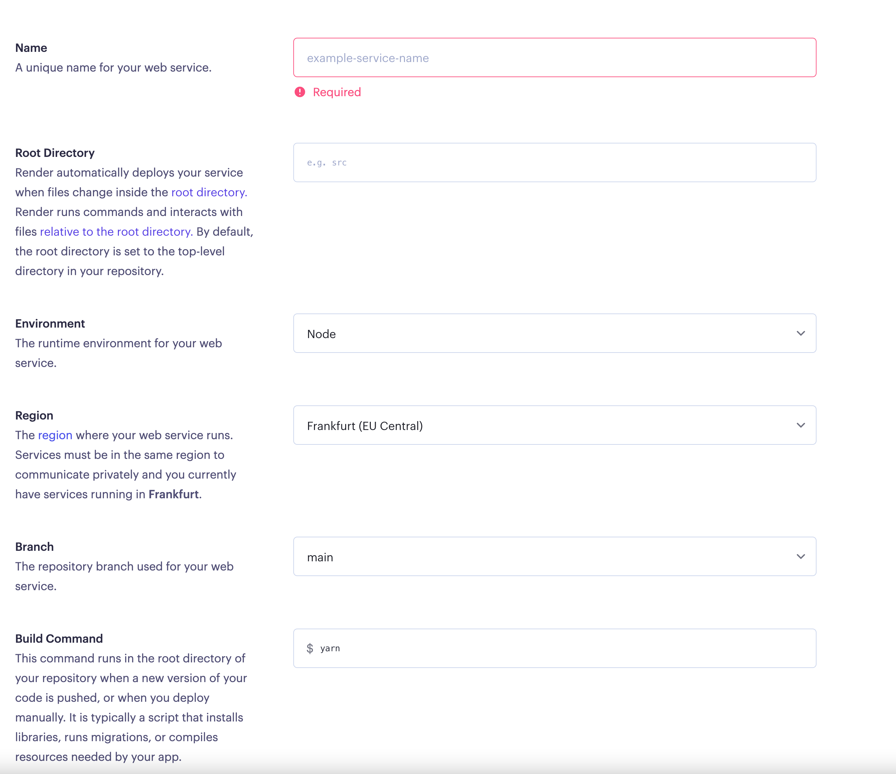
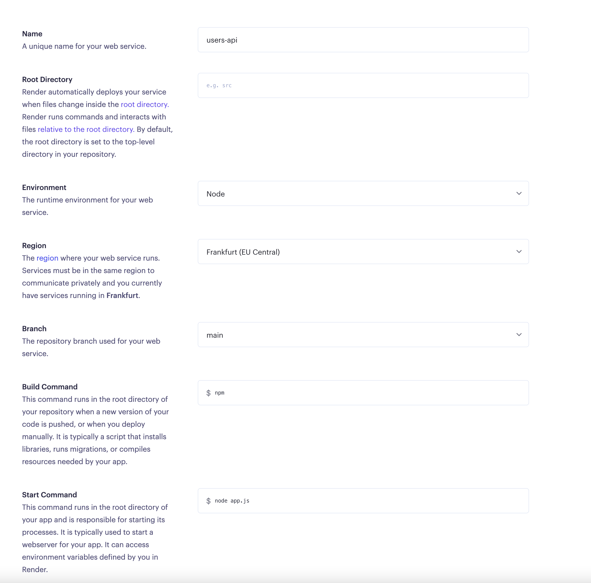
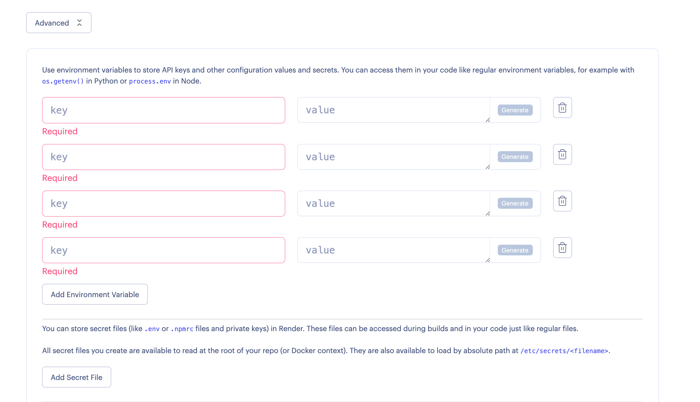

## Deploying to Render
[Render](https://render.com/). It's a free alternative to Heroku with a similar easy deployment process.
1. first step is to register in [Render](https://render.com/)

 

2. after you signed up and logged in to your account, you will see a dashboard like this:




> you need to connect your github account to render and select your repository to deploy.


3. to deploy fullstack app you need to have two repository (frontend,backend)

- To deploy a React application, click on the New Static Site Service under the Static Sites option.

-  You can also click on the New + button displayed in the header just before your profile picture and select Static site option.

- Once clicked, you will see the following screen:



- Click on the Connect account


Click on the Configure link  
and give access to only selected repositories which you currently need to deploy.




Now, you will see the following screen:



 - Here, for the Name field, enter the a short and simple name to identify your websit
 > example: i used the name : `render-frontend` 
 then my application URL once the application is deployed is:
 https://render-frontend.onrender.com/

 - add the Branch name, in my case : `main`
 - add the build command : `npm run build`
 - Publich directory : `build` 
 - click on Create Static Site Button

now the frontend link is ready : 


> any update on the repository will redeploy the repo again.
---
Now we are ready To deploy a Node.js application, click on the New Web Service button under the Web Services option.



- you need to add the node js code to a new repository and connect with render after that click next



- the name should be simple and will be used in our frontend.
> we will replace `http://localhost:5000/getallusers` with `https://users-app-api.onrender.com/getallusers`

- environment: `node`
- Branch : the default branch in this example is main
- build command: `npm install`
- start command:enter `node app.js` as the value, if your entry file is `app.js`.  


- After entering all the details, scroll down to the Plans section where the free plan will be automatically selected. If not selected, you need to select it because we're deploying the application for free.

- in the Advanced settings you can enter environment variables as shown below. 



- you need to add the `PORT` to your environment variables and use it in your application `process.env.PORT`
```javascript
const express = require("express");
const app = express();
const PORT = process.env.PORT || 5000;

// your code

app.listen(PORT, () => {
  console.log(`server started on port ${PORT}`);
});
```
> the Auto-Deploy field has default value of Yes – so once you push your code changes to GitHub repository, they will be automatically deployed to Render.

> If you don't want to auto-deploy your changes on every code change pushed to your GitHub repository, you can select the No value from the Auto-Deploy dropdown.
- Now, click on the the Create Web Service button to start the deployment process.
